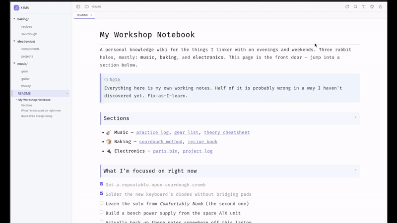
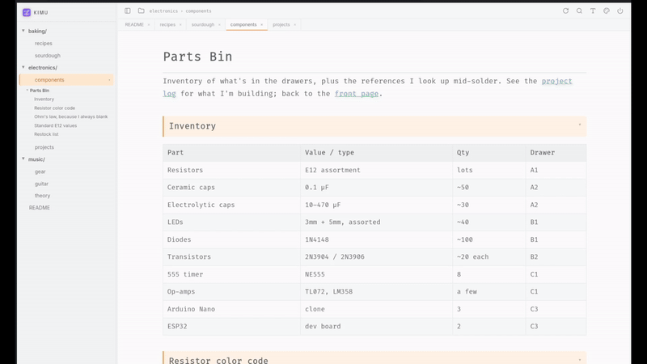
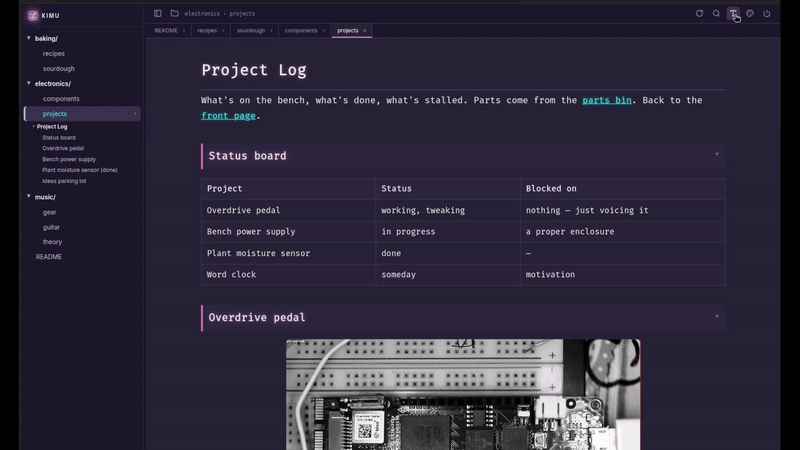
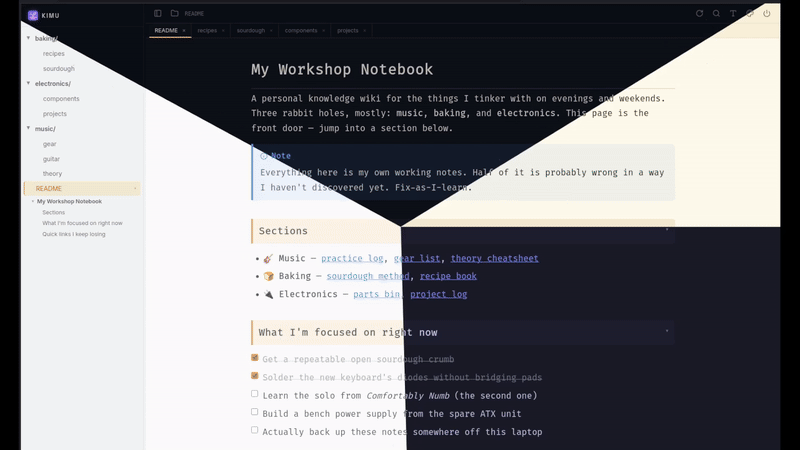

<p align="center">
  
</p>

<h1 align="center">Kimu</h1>

<p align="center">A tiny local Markdown viewer</p>

---

> [!IMPORTANT]
> **Disclaimer:** _This is internal tooling that I am sharing with you. It was more or less vibecoded; if you don't like that, please refrain from commenting. If you have any issues or suggestions, feel free to report them._

## What it does

Kimu serves a folder of `.md` files as a fast, single-page reader and scoped editor (edit tables, checkboxes). It features:

- **File tree** sidebar with collapsible folders and navigation
- **Deep links** to any heading, and working internal links between docs
- **Auto table of contents** with scroll-spy, per-document
- **Local images**:`` next to your docs renders inline



- **Tabs**: open multiple docs at once, remembers the position.


- **Inline editing**: toggle checkboxes and edit tables. Changes save instantly.



- **Adjustable Layout** (font, size, width), resizable sidebar



- **7 themes**: Light, Dark, Ayu Light/Dark, Dracula, Alucard, Synthwave



And more!
- **Syntax highlighting** in code blocks for major languages.
- **Mermaid diagrams**: fenced ` ```mermaid ` blocks render as diagrams.
- **LaTeX math** via KaTeX: `$…$` inline and `$$…$$` block equations.
- **Auto-reload**: Kimu watches for file changes and reloads automatically.
- **Full-text search** across all docs (`/` to open)
- **Admonitions**: Add admonitions with `> [!NOTE]` / `[!TIP]` / `[!WARNING]`
- **Easy to install**, no dependencies.
- **Fully offline**: JS and fonts are bundled, no CDN or internet needed

> [!NOTE]
> **Auto Reload and ad-blockers:** Auto Reload works by polling a local endpoint
> (`/api/stat`) for file changes. Some ad-blockers / privacy extensions
> (e.g. uBlock Origin) may block this request, which silently disables
> auto-reloading. If Auto Reload isn't picking up changes, allow-list
> `localhost` (or whichever host you run Kimu on) in your blocker. Manual reload
> always works regardless.

## Install

### Prerequisites

Kimu can be installed as a `kimu` command to `~/.local/bin` with [uv](https://docs.astral.sh/uv/). I

**Install uv** 

```bash
curl -LsSf https://astral.sh/uv/install.sh | sh
```

### Kimu Installation

**Get the code and install**

```bash
git clone https://github.com/benja-opazo/kimu
cd kimu
uv tool install .
```

**Make sure `~/.local/bin` is on your PATH.** If `kimu` isn't found after install:

```bash
uv tool update-shell      # then restart your shell
```

### Update / uninstall

```bash
uv tool install . --reinstall   # after pulling new changes (run from the repo)
uv tool uninstall kimu
```

## Run

```bash
kimu                 # opens kimu without a folder
kimu .               # serve the current directory
kimu ./docs          # serve a specific folder
kimu . -p 9000       # custom port (default 8765)
kimu --no-browser .  # don't auto-open a browser
```

`kimu` starts the server and opens it in your browser.

If no folder is selected, it shows a landing screen where you can click **Select folder…** to pick one. Once a folder is open, the toolbar's folder button switches to another.

### Without installing

```bash
uv run kimu ./docs           # or: uv run python -m kimu ./docs
```

## Add to the application list

```bash
kimu --install-launcher
```

Kimu then appears in your OS's app list with its icon, launching with no folder
→ the landing screen, where you pick a folder. User-level — no sudo/admin. Works
on all three platforms:

- **Linux** — a `.desktop` entry in `~/.local/share/applications` (shows in the
  app menu).
- **macOS** — a `Kimu.app` bundle in `~/Applications` (shows in Launchpad and
  Spotlight).
- **Windows** — a `Kimu.lnk` shortcut in the Start Menu.

Re-run the command after updating Kimu if its install path changes.

> The native folder dialog uses your OS tools: `osascript` (macOS) and
> `powershell` (Windows) are built in; on Linux it needs `zenity` or `kdialog`
> (usually preinstalled on GNOME/KDE). Without one, start Kimu with a folder
> from the terminal instead: `kimu <folder>`.
