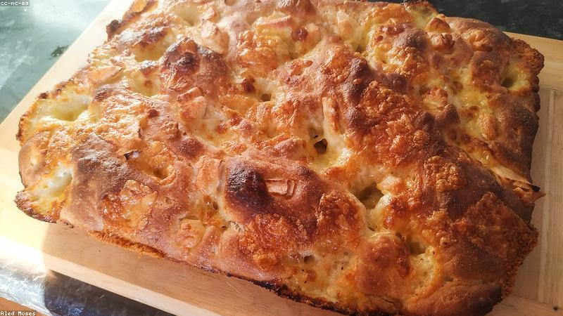

# Recipe Book

Things that aren't sourdough. The [sourdough method](sourdough.md) gets its own
page because it's a whole production. Back to the [front page](../README.md).

## Weeknight focaccia

Forgiving, no shaping, hard to ruin. Great when the [starter](sourdough.md#the-starter)
isn't ready and I want bread anyway.

| Ingredient | Weight |
|---|---|
| Bread flour | 500 g |
| Water | 400 g |
| Instant yeast | 7 g |
| Salt | 10 g |
| Olive oil | a generous glug |

1. Mix everything to a shaggy dough, no kneading
2. Cover, rise until doubled (~2 hr), or overnight in the fridge
3. Pour into a well-oiled tray, dimple with oily fingers
4. Top with rosemary and flaky salt
5. Bake **220 °C**, 20–25 min until golden

## Banana bread

The "the bananas have gone scary" standby.

| Ingredient | Amount |
|---|---|
| Overripe bananas | 3 |
| Flour | 250 g |
| Sugar | 150 g |
| Butter, melted | 100 g |
| Eggs | 2 |
| Baking soda | 1 tsp |
| Salt | a pinch |

Mash, mix wet, mix dry, combine, don't overmix. Loaf tin, **175 °C**, ~55 min.
Skewer comes out clean.

## Chocolate chip cookies

The ratio I always come back to:

| Ingredient | Amount |
|---|---|
| Butter | 225 g |
| Brown sugar | 200 g |
| White sugar | 100 g |
| Eggs | 2 |
| Flour | 350 g |
| Baking soda | 1 tsp |
| Chocolate chips | 300 g |

Chill the dough at least an hour (overnight is better). Bake **180 °C**, 11 min —
pull them when the edges are set but the middle still looks underdone.

## Notes to self

- [x] Buy a second loaf tin so I stop doing one batch at a time
- [ ] A proper enriched dough — brioche or cinnamon rolls
- [ ] Weigh eggs instead of counting them for consistency
- [ ] Write down the pizza dough before I forget it again
