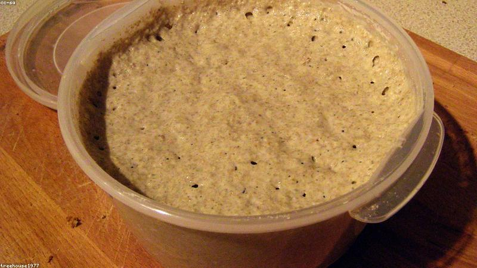
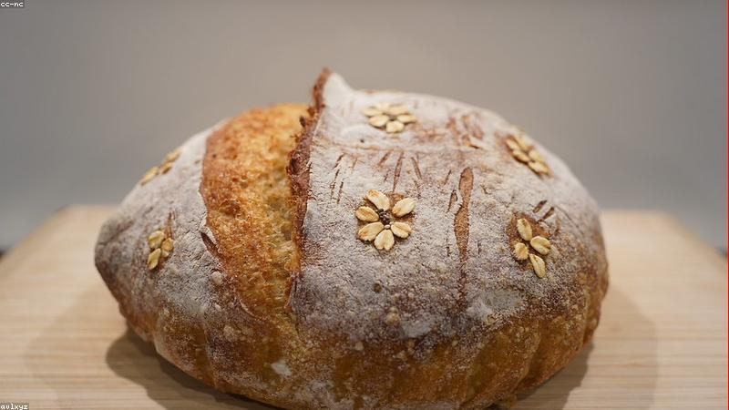

# Sourdough Method

My current working method for a plain country loaf. It changes every few bakes.
For other bakes see the [recipe book](recipes.md); back to the
[front page](../README.md).

## The starter

Named her *Yorick*. 100% hydration (equal flour and water by weight), fed once a
day when active, kept in the fridge when I'm not baking.

| Feed | Starter | Flour | Water |
|---|---|---|---|
| Maintenance | 20 g | 40 g | 40 g |
| Build for a bake | 30 g | 60 g | 60 g |

Ready when it doubles in 4–6 hours and a spoonful floats in water.

## The dough

Single loaf, ~75% hydration:

| Ingredient | Weight | Baker's % |
|---|---|---|
| Bread flour | 450 g | 90% |
| Whole wheat | 50 g | 10% |
| Water | 375 g | 75% |
| Active starter | 100 g | 20% |
| Salt | 10 g | 2% |

## Timeline

A weekend bake. Start Saturday morning, eat Sunday.

- [x] **09:00** Autolyse — mix flour + water, rest 1 hr
- [x] **10:00** Add starter and salt, mix to combine
- [ ] **10:30–13:00** Bulk ferment, 4 sets of stretch-and-folds, 30 min apart
- [ ] **13:00** Pre-shape, bench rest 20 min
- [ ] **13:30** Final shape, into the banneton
- [ ] **13:45** Cold retard in the fridge overnight (12–16 hr)
- [ ] **Sun 08:00** Bake straight from the fridge

## Baking

Dutch oven, preheated to **250 °C** for 45 min. This is the steam trick I keep
referencing from the [front page](../README.md#quick-links-i-keep-losing):

> [!CAUTION]
> The pot is 250 °C and the handle looks exactly the same as a cold one. Leather
> mitts, both hands, every single time. Ask me how I know.

1. Score the loaf with one confident slash (a hesitant slash drags)
2. Lid **on**, bake 20 min — the trapped steam gives the rise and shine
3. Lid **off**, drop to 220 °C, bake 20–25 min until deep brown
4. Cool on a rack at least 1 hour before cutting (yes, really)

## Troubleshooting

| Symptom | Likely cause | Fix |
|---|---|---|
| Flat, dense | under-proofed or weak starter | longer bulk, livelier starter |
| Gummy crumb | cut too early | wait, the bake continues while cooling |
| Tight, even crumb | over-degassed in shaping | gentler hands |
| Pale crust | not enough heat / steam | hotter preheat, keep lid on longer |
| Bursts at the side | under-scored | one deeper, decisive cut |

## Next experiments

- [ ] Push hydration to 80% and see if I can still handle it
- [ ] A 100% whole wheat version
- [ ] Try a longer, colder retard for more sour tang
