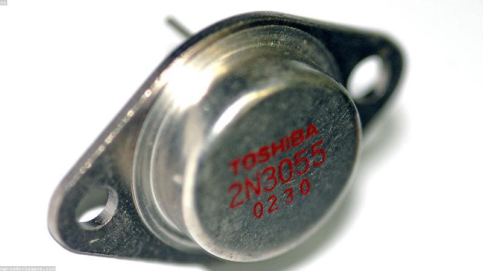

# Parts Bin

Inventory of what's in the drawers, plus the references I look up mid-solder.
See the [project log](projects.md) for what I'm building; back to the
[front page](../README.md).

## Inventory

| Part | Value / type | Qty | Drawer |
|---|---|---|---|
| Resistors | E12 assortment | lots | A1 |
| Ceramic caps | 0.1 µF | ~50 | A2 |
| Electrolytic caps | 10–470 µF | ~30 | A2 |
| LEDs | 3mm + 5mm, assorted | ~40 | B1 |
| Diodes | 1N4148 | ~100 | B1 |
| Transistors | 2N3904 / 2N3906 | ~20 each | B2 |
| 555 timer | NE555 | 8 | C1 |
| Op-amps | TL072, LM358 | a few | C1 |
| Arduino Nano | clone | 3 | C3 |
| ESP32 | dev board | 2 | C3 |

## Resistor color code

The reference I will never memorize. Bands, in order:

| Color | Digit | Multiplier |
|---|---|---|
| Black | 0 | ×1 |
| Brown | 1 | ×10 |
| Red | 2 | ×100 |
| Orange | 3 | ×1k |
| Yellow | 4 | ×10k |
| Green | 5 | ×100k |
| Blue | 6 | ×1M |
| Violet | 7 | ×10M |
| Grey | 8 | — |
| White | 9 | — |
| Gold | — | ±5% tolerance |

Mnemonic I half-remember: *Big Boys Race Our Young Girls But Violet Generally
Wins*. Violet vs grey is the pair that always trips me up.

## Ohm's law, because I always blank

- **V = I × R** — voltage = current × resistance
- **P = V × I** — power = voltage × current
- LED series resistor: **R = (V_supply − V_led) / I_led**
  - e.g. 5 V supply, 2 V red LED, 20 mA → (5 − 2) / 0.02 = **150 Ω**

## Standard E12 values

To find the nearest real resistor: 10, 12, 15, 18, 22, 27, 33, 39, 47, 56, 68,
82 — then ×10, ×100, and so on.

## Restock list

- [ ] More 0.1 µF caps — always run out mid-project
- [ ] Heat-shrink tubing assortment
- [x] A decent set of tweezers
- [ ] Proper desoldering braid (the cheap stuff is useless)
