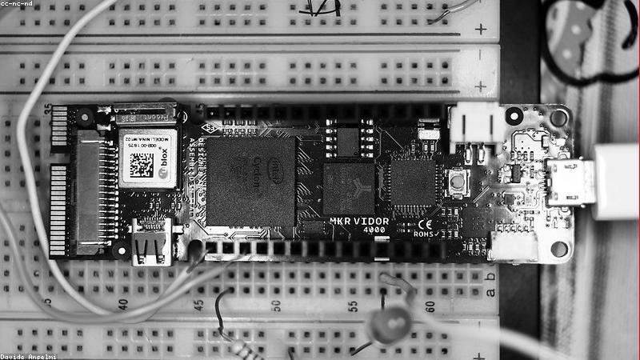
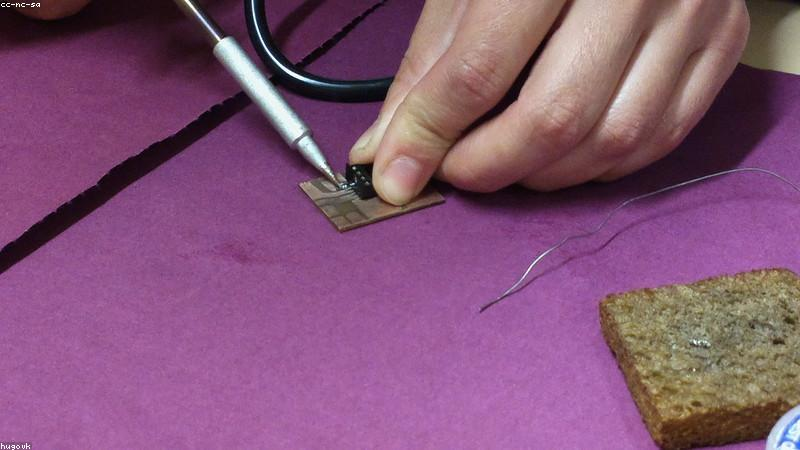

# Project Log

What's on the bench, what's done, what's stalled. Parts come from the
[parts bin](components.md). Back to the [front page](../README.md).

## Status board

| Project | Status | Blocked on |
|---|---|---|
| Overdrive pedal | working, tweaking | nothing — just voicing it |
| Bench power supply | in progress | a proper enclosure |
| Plant moisture sensor | done | — |
| Word clock | someday | motivation |

## Overdrive pedal

A Tube Screamer-ish clone for the [pedalboard](../music/gear.md#amp-effects). Soft
clipping around a [TL072](components.md#inventory) op-amp.

- [x] Breadboard the gain stage
- [x] Swap the clipping diodes (1N4148 → LED for more headroom)
- [x] Etch and populate the board
- [ ] Box it up and wire the true-bypass footswitch
- [ ] Decal that doesn't look terrible

**Note:** the LED clipping option is way louder than the diode one — needs a
trim on the output level. Compare the two by socketing the diodes.

## Bench power supply

Converting a dead PC's ATX unit into a variable bench supply.

| Rail | Voltage | Use |
|---|---|---|
| Yellow | +12 V | motors, the loud stuff |
| Red | +5 V | logic, USB |
| Orange | +3.3 V | the ESP32 and friends |
| Black | GND | — |

- [x] Add a load resistor on the 5 V rail so it stays regulated
- [x] Binding posts for each rail
- [ ] A buck converter for a continuously variable output
- [ ] Fuse the outputs before I let the smoke out

> [!WARNING]
> ATX supplies can source tens of amps. A dead short across the 12 V rail will
> happily vaporize a probe tip. Fuse every output before trusting it.

## Plant moisture sensor (done)

[ESP32](components.md#inventory) + capacitive moisture probe, reports to my phone
over WiFi. Deep-sleeps between readings so a battery lasts weeks.

Lessons learned:

1. **Capacitive** probes, not the resistive forks — the forks corrode in days
2. Calibrate dry-vs-wet per pot; the raw numbers mean nothing absolute
3. Deep sleep current matters more than active current for battery life

## Ideas parking lot

- [ ] Word clock with a WS2812 grid
- [ ] Reflow hotplate from a cheap clothes iron + thermocouple
- [ ] MIDI foot controller to pair with the [amp](../music/gear.md#amp-effects)
