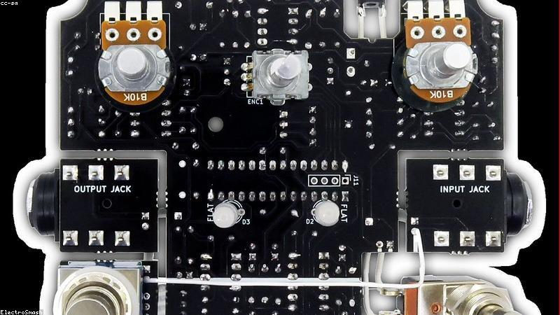

# Gear

What I own, what it's worth keeping, and what I'm saving up for. Back to the
[practice log](guitar.md) or the [front page](../README.md).

## Guitars

| Instrument | Year | Pickups | Strings | Notes |
|---|---|---|---|---|
| Squier Classic Vibe Strat | 2019 | SSS | 0.009–0.042 | main electric, plays great after a setup |
| Yamaha FG800 | 2021 | — | 0.012 phosphor bronze | the couch acoustic |
| Harley Benton bass (borrowed) | ? | PJ | 0.045–0.105 | need to give it back eventually |

## Amp & effects

- **Amp:** Fender Mustang LT25 — modeling, good for headphones at night
- **Pedals (in chain order):**
  1. Tuner (TC Polytune)
  2. Compressor
  3. Overdrive (a clone I built — see [projects](../electronics/projects.md#overdrive-pedal))
  4. Delay
  5. Reverb

## Strings & consumables

| Item | Brand | Restock when | Cost |
|---|---|---|---|
| Electric strings | D'Addario EXL120 | every ~6 weeks | low |
| Acoustic strings | Elixir Nanoweb | every ~3 months | medium |
| Picks | Dunlop 0.73mm | I lose them constantly | trivial |
| Fretboard oil | lemon oil | twice a year | low |

## Setup specs I keep forgetting

- Strat action: **1.6 mm** treble, **2.0 mm** bass at the 12th fret
- Relief: a hair of forward bow, capo at 1, press at last fret, ~0.25 mm gap
- Intonation checked with the [tuner reference](../README.md#quick-links-i-keep-losing)

## Wishlist

- [ ] A proper tube amp for the living room (and a divorce, probably)
- [ ] Looper pedal — would make practice way more fun
- [x] Decent guitar stand so it stops falling over
- [ ] Hard case for the acoustic
